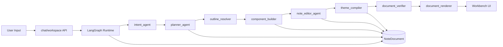

# XHS-Forge

XHS-Forge 是一个面向类小红书内容创作的 Agent 工作台。用户可以用自然语言生成并持续编辑一篇笔记，系统围绕统一的 `NoteDocument` 协议维护长期状态，支持结构化编辑、版本回滚/分叉、RAG 搜证、热点缓存、Benchmark 评估和前端可观察性。

## What It Is

- 不是一次性吐文案的聊天机器人
- 不是纯 AST 页面生成器
- 是一个可持续编辑、可追踪、可回滚的内容创作系统

当前正式架构已经统一到：

- Agent 决策层：
  - `intent_agent`
  - `planner_agent`
  - `note_editor_agent`
- 确定性执行层：
  - `outline_resolver`
  - `component_builder`
  - `theme_compiler`
  - `document_verifier`
  - `document_renderer`
- 单一主协议：
  - `NoteDocument`

## Highlights

- 统一内核：运行时、前后端、Inspector、Benchmark 都围绕 `NoteDocument`
- Modern Agent：LangGraph 工作流 + 少量高价值 agent 节点 + 大量确定性执行层
- Structured Editing：已有页面优先走结构化编辑，而不是整页重写
- RAG：支持 `system_preload` 和 `task_triggered_ingest`，并具备 grounding、citation、policy、anti-decay
- Cache：热点知识缓存具备 TTL、freshness、cache diagnostics
- Observability：Prompt Lab、Agent 状态、事实与检索、Benchmark 全部前端可见
- Interview-ready：项目主线、评估层和展示层都已封板

## Core Capabilities

### 1. Long-lived Note Editing

- 生成首版页面
- 继续说“保留标题，重写第二段”
- 修改组件、移动顺序、替换积木、切换主题
- 保持同一份 `NoteDocument` 状态持续演化

### 2. RAG + Grounding

- 系统后台预热热点知识
- 用户任务触发搜证后沉淀知识
- 检索策略、引用来源、grounding 状态前端可见
- citation coverage、grounding score、source quality 进入 Benchmark

### 3. Workspace Workflow

- checkpoint / rollback / fork
- asset import / set cover
- fact confirmation
- trace / benchmark / inspector

## Quick Start

### Backend

```bash
cd /root/XHS-Forge
python -m venv .venv
source .venv/bin/activate
pip install -r AI_Frontend_IDE/requirements.txt
cp AI_Frontend_IDE/.env.example AI_Frontend_IDE/.env
uvicorn AI_Frontend_IDE.app.main:app --reload --port 8000
```

### Frontend

```bash
cd /root/XHS-Forge/ai-frontend-ide
npm install
npm run dev
```

### Final Acceptance

```bash
cd /root/XHS-Forge
bash scripts/final_acceptance.sh
```

当前封板状态的最终验收结果：

- backend: `180 passed, 1 skipped`
- guardrails: `21 passed`
- frontend production build: passed

## Repo Map

- Backend runtime:
  - [`AI_Frontend_IDE/app/agents/graph.py`](AI_Frontend_IDE/app/agents/graph.py)
- Core protocol:
  - [`AI_Frontend_IDE/app/core/note_document.py`](AI_Frontend_IDE/app/core/note_document.py)
  - [`AI_Frontend_IDE/app/core/component_manifest.py`](AI_Frontend_IDE/app/core/component_manifest.py)
- Prompt / context engineering:
  - [`AI_Frontend_IDE/app/core/prompt_engineering.py`](AI_Frontend_IDE/app/core/prompt_engineering.py)
  - [`AI_Frontend_IDE/app/core/context_engineering.py`](AI_Frontend_IDE/app/core/context_engineering.py)
- RAG backend:
  - [`AI_Frontend_IDE/app/services/rag_service.py`](AI_Frontend_IDE/app/services/rag_service.py)
  - [`AI_Frontend_IDE/app/services/rag_ingestion.py`](AI_Frontend_IDE/app/services/rag_ingestion.py)
  - [`AI_Frontend_IDE/app/services/rag_policy.py`](AI_Frontend_IDE/app/services/rag_policy.py)
  - [`AI_Frontend_IDE/app/services/cache_service.py`](AI_Frontend_IDE/app/services/cache_service.py)
- Frontend workbench:
  - [`ai-frontend-ide/src/stores/useChatStore.ts`](ai-frontend-ide/src/stores/useChatStore.ts)
  - [`ai-frontend-ide/src/components/chat/AgentInspector.vue`](ai-frontend-ide/src/components/chat/AgentInspector.vue)

## Delivery Docs

- 架构图 / 流程图：
  - [`docs/ARCHITECTURE_AND_FLOW.md`](docs/ARCHITECTURE_AND_FLOW.md)
- Demo script：
  - [`docs/DEMO_SCRIPT.md`](docs/DEMO_SCRIPT.md)
- 面试讲稿：
  - [`docs/INTERVIEW_TALK_TRACK.md`](docs/INTERVIEW_TALK_TRACK.md)
- 简历项目描述：
  - [`docs/RESUME_PROJECT_DESCRIPTION.md`](docs/RESUME_PROJECT_DESCRIPTION.md)
- 交付总览：
  - [`docs/INTERVIEW_DELIVERY_PACK.md`](docs/INTERVIEW_DELIVERY_PACK.md)

## Architecture Summary



## Interview Positioning

这个项目最适合以下岗位叙事：

- Agent Application Engineer
- AI Product Engineer
- AI Backend Engineer
- GenAI Full Stack Engineer

你可以把它讲成：

> 一个以 `NoteDocument` 为单一协议、结合 LangGraph runtime、structured editing、RAG grounding、热点缓存与 Benchmark 面板的内容创作 Agent 工作台。
