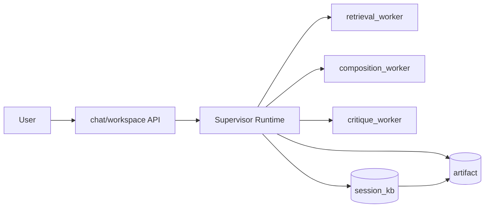

# XHS-Forge

XHS-Forge 现在是一个 **持续交互式笔记 Agent 工作台**。用户始终只和一个 supervisor 对话，系统围绕一份持续演化的 `note_workspace` artifact 工作，支持资料导入、候选知识审查、局部改写、版本回滚/分叉、RAG 搜证、修订建议和前端白盒观测。

## What It Is

- 不是一次性吐文案的聊天机器人
- 不是只会生成长文本的笔记工具
- 是一个围绕 **同一份笔记 artifact** 持续协作、持续修订的 Agent 系统

当前正式架构统一到：

- 顶层主控：
  - `create_agent` supervisor runtime
- 固定 worker：
  - `retrieval_worker`
  - `composition_worker`
  - `critique_worker`
- 单一主协议：
  - `artifact`
  - `artifact_version`
  - `SupervisorSessionState`

## Highlights

- Artifact-centered：每次成功 turn 都能沉淀一个 `artifact_version`
- Free-dialogue Supervisor：用户始终只和一个 supervisor 对话
- Structured Revision：局部重做、高亮、revision loop 都围绕 artifact diff
- Knowledge Governance：`candidate_session_kb -> session_kb -> persistent_kb`
- RAG as Evidence Layer：结构化优先，混合检索补证据，向量库只做可重建召回缓存
- Observability：worker、skill、tool、knowledge version、failure point 前端可见

## Core Capabilities

### 1. Long-lived Note Artifact

- 新建一份笔记
- 继续说“保留结构，把开头改得更直接”
- 继续说“补一段背景，再加两张说明图”
- 继续说“把这版分叉成一个更适合对外展示的版本”
- 同一份 artifact 持续演化，并保留版本链

### 2. Knowledge-grounded Note Building

- 会话知识、正式知识、缓存和联网搜索协同工作
- 所有外部命中先进入待审会话知识
- 审过后才能进入正式生成与修订
- grounding、citation、knowledge version 进入 trace 与评估

### 3. Revision Workflow

- critique 默认不打断聊天主流程
- 输入框旁有轻量 revision panel
- 用户点击 `听取意见` 才进入 revision loop
- revision 成功后自动生成新的 artifact version

## Quick Start

### Backend

```bash
cd /root/XHS-Forge
python -m venv .venv
source .venv/bin/activate
pip install -r AI_Frontend_IDE/requirements.txt
cp AI_Frontend_IDE/.env.example AI_Frontend_IDE/.env
uvicorn AI_Frontend_IDE.app.main:app --reload --port 8000
```

### Frontend

```bash
cd /root/XHS-Forge/ai-frontend-ide
npm install
npm run dev
```

## Repo Map

- Supervisor runtime:
  - [`AI_Frontend_IDE/app/agents/runtime/supervisor_runtime.py`](AI_Frontend_IDE/app/agents/runtime/supervisor_runtime.py)
  - [`AI_Frontend_IDE/app/agents/runtime/session_state.py`](AI_Frontend_IDE/app/agents/runtime/session_state.py)
- Workers:
  - [`AI_Frontend_IDE/app/agents/workers`](AI_Frontend_IDE/app/agents/workers)
- Artifact / revision services:
  - [`AI_Frontend_IDE/app/agents/services/artifact_service.py`](AI_Frontend_IDE/app/agents/services/artifact_service.py)
  - [`AI_Frontend_IDE/app/agents/services/revision_service.py`](AI_Frontend_IDE/app/agents/services/revision_service.py)
  - [`AI_Frontend_IDE/app/agents/services/session_state_service.py`](AI_Frontend_IDE/app/agents/services/session_state_service.py)
- Knowledge / RAG backend:
  - [`AI_Frontend_IDE/app/services/knowledge_hub.py`](AI_Frontend_IDE/app/services/knowledge_hub.py)
  - [`AI_Frontend_IDE/app/services/rag_service.py`](AI_Frontend_IDE/app/services/rag_service.py)
  - [`AI_Frontend_IDE/app/services/cache_service.py`](AI_Frontend_IDE/app/services/cache_service.py)
- Frontend workbench:
  - [`ai-frontend-ide/src/stores/useChatStore.ts`](ai-frontend-ide/src/stores/useChatStore.ts)
  - [`ai-frontend-ide/src/components/chat/RevisionAssistPanel.vue`](ai-frontend-ide/src/components/chat/RevisionAssistPanel.vue)
  - [`ai-frontend-ide/src/components/chat/AgentInspector.vue`](ai-frontend-ide/src/components/chat/AgentInspector.vue)

## Architecture Summary



## Positioning

你可以把它讲成：

> 一个围绕 artifact/version、知识审查、revision loop 和白盒观测构建的持续交互式笔记 Agent 工作台。
