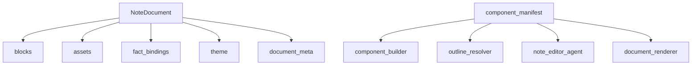
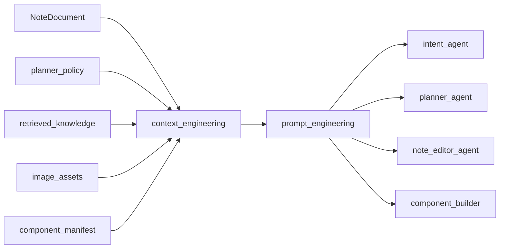
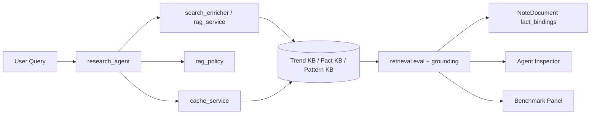
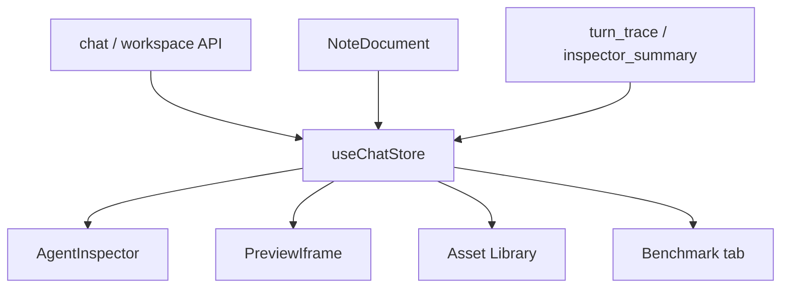
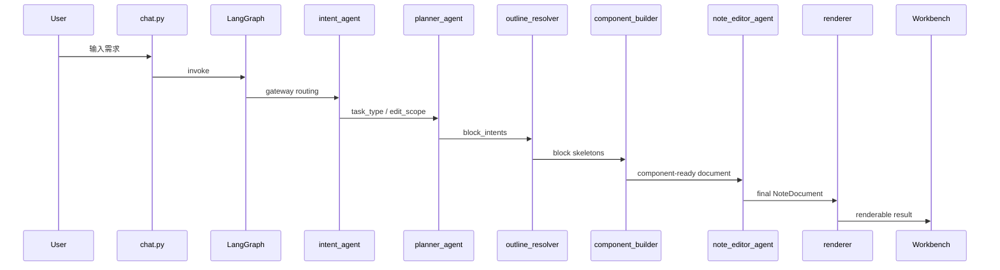

# Architecture And Flow

最后更新: 2026-03-21

这份文档是面试和代码审阅时使用的最终架构图说明。目标不是覆盖所有实现细节，而是让读者在 3 到 5 分钟内理解：

- 系统围绕什么对象运行
- agent 在哪里
- 确定性模块在哪里
- RAG / cache / benchmark 怎么挂进整套系统

## 1. One-line Architecture

XHS-Forge 是一套以 `NoteDocument` 为唯一主协议、由 LangGraph 编排少量决策 agent 和大量确定性执行层的内容创作工作台。

## 2. Core Runtime

```mermaid
flowchart LR
    U[User Input] --> API[chat.py / workspace.py]
    API --> G[LangGraph Runtime]
    G --> I[intent_agent]
    I --> P[planner_agent]
    P --> O[outline_resolver]
    O --> B[component_builder]
    B --> E[note_editor_agent]
    E --> T[theme_compiler]
    T --> V[document_verifier]
    V --> R[document_renderer]
    R --> UI[Workbench UI]
```

### 如何理解

- `LangGraph Runtime`
  - 负责编排、状态流转、checkpoint、会话恢复
- `intent_agent`
  - 只做网关判断
- `planner_agent`
  - 只做页面策略和 block intents
- `outline_resolver`
  - 把 block intents 稳定映射成积木 skeleton
- `component_builder`
  - 在 manifest contract 下生成区块 payload
- `note_editor_agent`
  - 负责已有页面的开放式编辑决策
- `theme_compiler / verifier / renderer`
  - 属于确定性执行层

## 3. Single Source Of Truth

### 真相源

- 主状态真相源：
  - `NoteDocument`
- 组件能力真相源：
  - `component_manifest`
- 页面策略真相源：
  - `planner_output / planner_policy`

项目里已经没有第二套 DSL 或旧页面协议。

## 4. Prompt And Context Engineering

### 当前上下文工程的核心原则

- 不再把大对象整包直喂给模型
- 按节点职责喂压缩后的上下文包
- 统一上下文包命名：
  - `document_summary`
  - `selection_context`
  - `policy_summary`
  - `fact_summary`
  - `asset_summary`
  - `evidence_slice`

## 5. RAG, Cache, Grounding

### 已完成的能力

- `system_preload`
- `task_triggered_ingest`
- retrieval policy / rerank
- citation / grounding
- anti-decay / freshness
- cache TTL / freshness / diagnostics
- benchmark aggregation

## 6. Frontend Workbench

### 前端现在承担的职责

- 工作台状态协调
- 协议可视化
- 单轮 Inspector
- 跨会话 Benchmark
- Prompt Lab / Trace 观测

### 前端不再承担的职责

- 旧页面协议兼容
- DSL 适配
- 核心业务决策

## 7. Request Flow

## 8. Why This Is A Good Interview Story

这套架构对面试最有价值的点不只是“用了 agent”，而是：

- 用统一协议解决长期编辑问题
- 用 LangGraph 解决工作流和状态问题
- 用少量 agent 解决高价值决策
- 用 RAG / cache / benchmark 补齐工程闭环
- 用 Inspector 和 Benchmark 把系统过程真正展示出来

## 9. 阅读代码的推荐顺序

1. [`README.md`](/root/XHS-Forge/README.md)
2. [`AI_Frontend_IDE/app/agents/graph.py`](/root/XHS-Forge/AI_Frontend_IDE/app/agents/graph.py)
3. [`AI_Frontend_IDE/app/core/note_document.py`](/root/XHS-Forge/AI_Frontend_IDE/app/core/note_document.py)
4. [`AI_Frontend_IDE/app/core/component_manifest.py`](/root/XHS-Forge/AI_Frontend_IDE/app/core/component_manifest.py)
5. [`AI_Frontend_IDE/app/core/context_engineering.py`](/root/XHS-Forge/AI_Frontend_IDE/app/core/context_engineering.py)
6. [`AI_Frontend_IDE/app/core/prompt_engineering.py`](/root/XHS-Forge/AI_Frontend_IDE/app/core/prompt_engineering.py)
7. [`AI_Frontend_IDE/app/agents/nodes/note_editor_node.py`](/root/XHS-Forge/AI_Frontend_IDE/app/agents/nodes/note_editor_node.py)
8. [`AI_Frontend_IDE/app/services/rag_policy.py`](/root/XHS-Forge/AI_Frontend_IDE/app/services/rag_policy.py)
9. [`AI_Frontend_IDE/app/services/cache_service.py`](/root/XHS-Forge/AI_Frontend_IDE/app/services/cache_service.py)
10. [`ai-frontend-ide/src/components/chat/AgentInspector.vue`](/root/XHS-Forge/ai-frontend-ide/src/components/chat/AgentInspector.vue)
