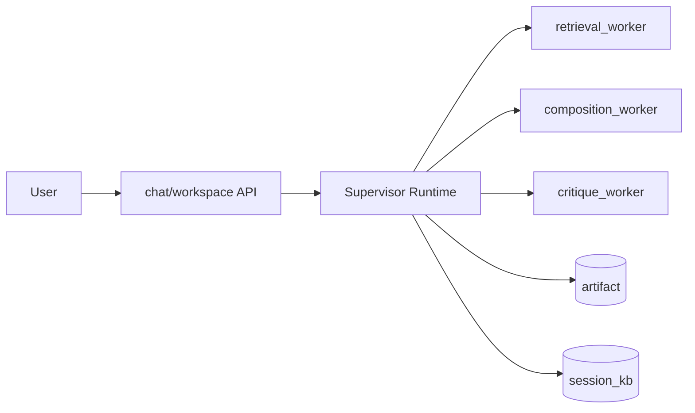

# Architecture And Flow

最后更新: 2026-03-24

这份文档只描述当前正式主线，不保留历史 graph 架构说明。

## 1. One-line Architecture

XHS-Forge 是一个 **自由对话式 Supervisor Agent + Artifact-Centered 成品系统**。  
用户只和一个 supervisor 对话，系统围绕一份持续演化的 `purchase_decision_note` artifact 工作。

## 2. Top-level Runtime

关键点：

- supervisor 是唯一对话入口
- worker 不直接和用户说话
- 每轮由 supervisor 动态决定调用哪个 worker

## 3. Formal Runtime Modules

- Supervisor runtime：
  - [`AI_Frontend_IDE/app/agents/runtime/supervisor_runtime.py`](../AI_Frontend_IDE/app/agents/runtime/supervisor_runtime.py)
- Session state：
  - [`AI_Frontend_IDE/app/agents/runtime/session_state.py`](../AI_Frontend_IDE/app/agents/runtime/session_state.py)
- State helpers：
  - [`AI_Frontend_IDE/app/agents/runtime/state_helpers.py`](../AI_Frontend_IDE/app/agents/runtime/state_helpers.py)
- Session state service：
  - [`AI_Frontend_IDE/app/agents/services/session_state_service.py`](../AI_Frontend_IDE/app/agents/services/session_state_service.py)

## 4. Worker Responsibilities

### `retrieval_worker`
- 查询结构化知识
- 读取 `knowledge_snapshot/cache`
- 触发混合检索与联网搜索
- 读取资料索引

### `composition_worker`
- 修改标题、结论、对比、风险、正文
- 落地局部重做
- 生成 `changed_blocks`

### `critique_worker`
- 内部分析 `knowledge_gap / expression_gap`
- 输出 revision 建议
- 不直接打断聊天主流程

补充：

- `retrieval_worker` 同时承担原来的知识审查前整理与素材线索补齐职责
- `composition_worker` 同时承担原来的图片/素材落地职责

## 5. Artifact / Version

系统正式围绕 artifact/version 工作。

### `artifact`
- `artifact_id`
- `artifact_type = purchase_decision_note`
- `current_version_id`
- `current_snapshot_id`
- `title`
- `status`

### `artifact_version`
- `version_id`
- `parent_version_id`
- `snapshot_id`
- `revision_reason`
- `changed_blocks`
- `assets_delta`
- `knowledge_version`
- `created_at`

规则：

- 每次成功 turn 生成一个新 `artifact_version`
- rollback/branch 都围绕 artifact version 对应 snapshot 工作
- 高亮、最近变更块、diff 都从 artifact version 派生

## 6. Revision Loop

revision 是正式产品能力，不再作为聊天里的强打断卡片。

流程：

1. critique worker 产出 revision 建议
2. 输入框旁 `RevisionAssistPanel` 展示一个主建议
3. 用户点击 `听取意见`
4. supervisor 生成 `revision_plan`
5. 动态调 retrieval / composition worker
6. `revision_service` 校验结果
7. 成功则生成新 `artifact_version`

只有高风险场景才会升级成 blocking checkpoint。

## 7. Knowledge Chain

正式检索顺序：

1. `user_provided_facts`
2. `session_kb`
3. `persistent_kb`
4. `knowledge_snapshot`
5. `web_search`

治理规则：

- 所有外部命中先进入 `candidate_session_kb`
- 审过后才能进入 `session_kb`
- `persistent_kb` 作为慢入口，只接收已确认知识和长期资料

## 8. Session / Global Separation

### 会话工作台
- 当前 artifact
- 当前版本
- 当前会话知识
- 当前 trace / revision 状态

### 全局资产中心
- 正式知识库
- 长期资料
- demo packs
- benchmark / evaluation

全局知识不会直接污染当前会话；只会以快照导入 session，再被 artifact version 引用。

## 9. White-box Observability

诊断面板固定显示：

- 当前 phase
- 当前 worker
- 当前 skill
- 当前工具调用
- 当前 artifact version
- 当前 knowledge version
- 当前 failure point

## 10. Reading Order

推荐按这个顺序读代码：

1. [`README.md`](../README.md)
2. [`AI_Frontend_IDE/app/agents/runtime/supervisor_runtime.py`](../AI_Frontend_IDE/app/agents/runtime/supervisor_runtime.py)
3. [`AI_Frontend_IDE/app/agents/runtime/session_state.py`](../AI_Frontend_IDE/app/agents/runtime/session_state.py)
4. [`AI_Frontend_IDE/app/agents/services/artifact_service.py`](../AI_Frontend_IDE/app/agents/services/artifact_service.py)
5. [`AI_Frontend_IDE/app/agents/services/revision_service.py`](../AI_Frontend_IDE/app/agents/services/revision_service.py)
6. [`AI_Frontend_IDE/app/services/knowledge_hub.py`](../AI_Frontend_IDE/app/services/knowledge_hub.py)
7. [`AI_Frontend_IDE/app/api/chat.py`](../AI_Frontend_IDE/app/api/chat.py)
8. [`AI_Frontend_IDE/app/api/workspace.py`](../AI_Frontend_IDE/app/api/workspace.py)
9. [`ai-frontend-ide/src/components/chat/RevisionAssistPanel.vue`](../ai-frontend-ide/src/components/chat/RevisionAssistPanel.vue)
10. [`ai-frontend-ide/src/components/chat/AgentInspector.vue`](../ai-frontend-ide/src/components/chat/AgentInspector.vue)
